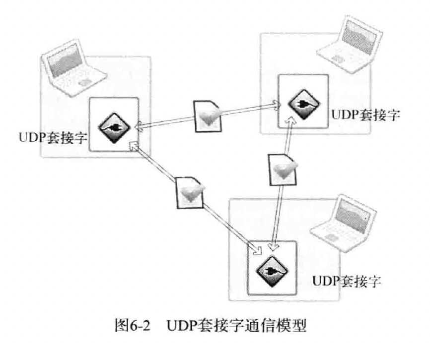

# UDP
类比为邮件
套接字就像是**邮筒**，只需要有一个邮筒就可像任意主机传输数据
## UDP 中服务器端与客户端没有连接
### UDP 服务器端和客户端均只需要 1 个套接字

### UDP 的数据 I/O函数
#### 发送函数
```c
#include <sys/socket.h>

// sock 套接字
// buff 待传输数据的缓冲地址
// nbytes   待传输数据长度，单位为字节
// flags    可选参数，没有传 0
// to       目标地址
// addrlen  目标地址 to的长度 
ssize_t sendto(int sock, void *buff, size_t nbytes, int flags, struct sockaddr *to, socklen_t addrlen);
```

#### 接受函数
```c
#include <sys/socket.h>

// from 和 addrlen用于存读取到的 udp 报文的 sockaddr 和 addrlen
ssize_t recvfrom(int sock, void *buff, size_t nbytes, int flags, struct sockaddr *from, socklen_t *addrlen);
```
## 实现了一个 upd 版本的 echo_server
```shell
mkdir build
cd build
cmake ..
make
```
### 运行
```shell
# 在一个 shell中启动服务端
bin/server

# 在另一个 shell中启动客户端
bin/client
```
### clean
```shell
make clean_build
```